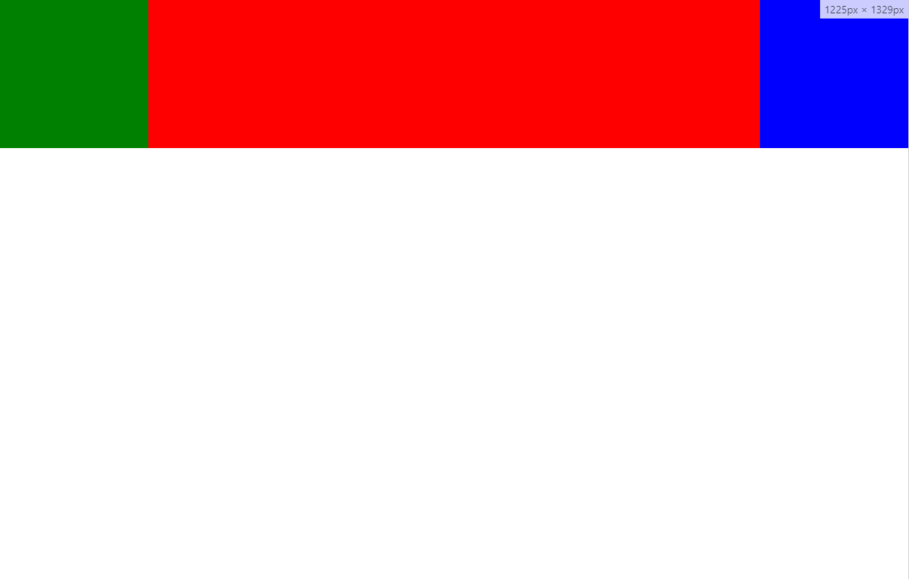

# 圣杯布局
> 所谓圣杯布局就是左右两边宽度固定，中间宽度自适应，常规解决方案有三种，包括flex布局，calc，定位等




## 使用定位
> 使用定位解决布局问题主要思路就是，把固定宽度的位置用padding让出来，然后把固定宽度的两个div使用定位定位到padding区域

```
// css
*{margin: 0;padding:0;}
.main{width:100%;position: relative;padding: 0 200px;height:200px;box-sizing: border-box;}
.center{width: 1900%;height: 100%;background-color: red;}
.right{width: 200px;height: 100%;position: absolute;top: 0;right: 0;background-color: blue;}
.left{width: 200px;height: 100%;position: absolute;top: 0;left: 0;background-color: green;}

// html
<div class="main">
    <div class="left"></div>
    <div class="center"></div>
    <div class="right"></div>
</div>
```


## 使用calc
> 使用calc的思路就是，让中间宽度不固定的元素通过计算来得到，也就是总宽度减去固定宽度，然后让div排列在一排就可以了，排列在一排可以使用display或float、flex都可以

```
// css
*{margin: 0;padding:0;}
.main{width: 100%;height:200px;}
.main>div{float: left;height:100%;}
.center{width: calc(100% - 400px);background-color: red;}
.right{width: 200px;background-color: blue;}
.left{width:200px;background-color: green;}
// html
<div class="main">
    <div class="left"></div>
    <div class="center"></div>
    <div class="right"></div>
</div>
```

## 使用flex

> 经典flex布局，使用flex：1

```
// css
*{margin: 0;padding:0;}
.main{width:100%;display: flex;height:200px;}
.main>div{height: 100%;}
.left{width:200px;background-color: green;}
.center{flex: 1;background-color: red;}
.right{width: 200px;background-color: blue;}
// html
<div class="main">
    <div class="left"></div>
    <div class="center"></div>
    <div class="right"></div>
</div>
```


