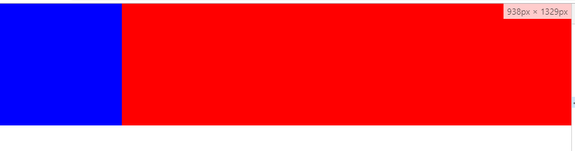

# 左固定右占满布局

> 这也是几种常见的布局之一，在面试中碰到了所以记录下来,解决方法很多，float,position,flex,bfc,margin,calc等




## 使用float

```
*{margin: 0;padding:0;}
.main{width:100%;height:200px;}
.main>div{height: 100%;}
.left{width:200px;background-color: blue;float: left;}
.right{margin-left:200px;background-color: red;}

<div class="main">
    <div class="left"></div>
    <div class="right"></div>
</div>
```

## 使用position
```
*{margin: 0;padding:0;}
.main{width:100%;height:200px;position: relative;}
.main>div{height: 100%;}
.left{width:200px;background-color: blue;position: relative;z-index: 1;}
.right{background-color: red;position: absolute;left:0;top:0;width:100%;padding-left: 200px;box-sizing: border-box;}

<div class="main">
    <div class="left"></div>
    <div class="right"></div>
</div>
```

## 使用flex
```
*{margin: 0;padding:0;}
.main{width:100%;height:200px;display: flex;}
.main>div{height: 100%;}
.left{width:200px;background-color: blue;}
.right{background-color: red;flex:1;}

<div class="main">
    <div class="left"></div>
    <div class="right"></div>
</div>
```

## 使用负margin
```
*{margin: 0;padding:0;font-size: 0;}
.main{width:100%;height:200px;}
.main>div{height: 100%;display: inline-block;box-sizing: border-box;}
.left{width:200px;background-color: blue;position: relative;}
.right{width: 100%;background-color: red;padding-left: 200px;margin-left:-200px;}

<div class="main">
    <div class="left"></div>
    <div class="right"></div>
</div>
```

## 使用bfc
```
*{margin: 0;padding:0;font-size: 0;}
.main{width:100%;height:200px;}
.main>div{height: 100%;}
.left{width:200px;float: left;background-color: blue;}
.right{background-color: red;overflow: hidden;}

<div class="main">
    <div class="left"></div>
    <div class="right"></div>
</div>
```

## 使用calc
```
*{margin: 0;padding:0;font-size: 0;}
.main{width:100%;height:200px;}
.main>div{height: 100%;float: left;}
.left{width:200px;background-color: blue;}
.right{width: calc(100% - 200px);background-color: red;}

<div class="main">
    <div class="left"></div>
    <div class="right"></div>
</div>
```
