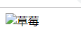
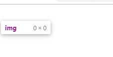
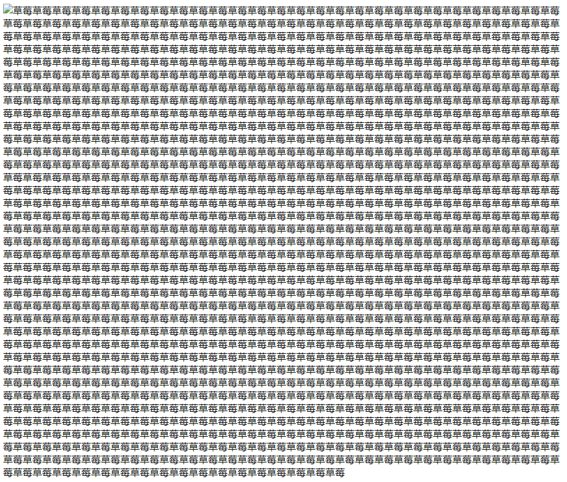
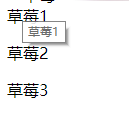
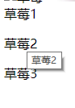
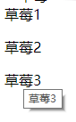

# alt和title的区别

在书写html文档时经常会用到img标签，img标签拥有一个属性叫做```alt```  
一些书写不规范的小伙伴可能直接就跳过了，或者对alt标签的了解是存在于seo方面的，有了解过seo的爬虫检索会抓取到img的alt字段  

## alternative

>img标签的alt属性的全拼就是alternative。意思就是当img中src属性指定的图片有问题（比如不存在）无法正常显示时，用来代替显示的文字，以免网页中出现空白天窗使用户产生困惑甚至误解

```
// index.html

```



如果不写alt标签是什么效果呢

```
// index.html

```


页面一片空白，看不出任何效果，打开F12选中img标签可以看到img标签的宽高都为0切看不到任何文字提示

> alt的另一个考点就是alt属性的长度上限，这个属于一个陷阱问题，因为alt是没有上限的，如图



## title
> HTML的title属性为全局属性，规定有关元素的额外信息

那么我们来试验一下所谓的额外信息是什么样的展现形式

```
// index.html


```


从这张效果图可以看出，title的文字是由鼠标悬停触发的。
以上是为img标签所添加的title属性，前面提到title为html的全局属性，我们尝试一下可不可以给div、p、span标签添加title 属性

```
// index.html
<div title="草莓1">草莓1</div>
<p title="草莓2">草莓2</p>
<span title="草莓3">草莓3</span>
```





> title属性的上限，chrome浏览器规定title的上限为1024字节，utf-8的编码格式中，汉字占用3到4个字节，一段文字中可能会有英文、标点符号、数字等，所以把长度控制在300以内较为合理


## 面试回答
面试中也碰到了几次问title和alt属性的区别

alt为img标签的一个属性，用于在图片加载失败时提示用户这里应该有一张什么类型的图片应该加载出来，以免让用户面对一块空白区域产生疑惑，引起不好的用户体验

title为html的全局属性，当鼠标悬停的时候会有一个文字提示，常用语链接或按钮上，来提示用户点击后网页会发生什么变化

alt属性没有长度限制，title属性限制在1024字节以内


